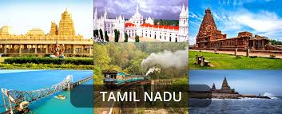
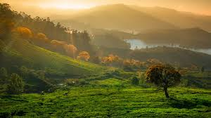
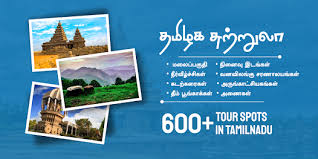
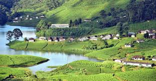
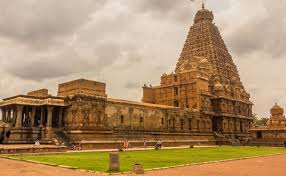
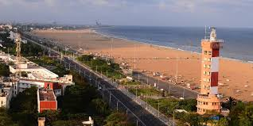
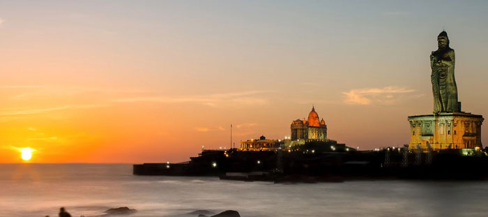
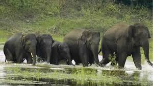
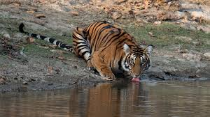

 > # **Tamilnadu Tourism and Travel** 

**Inroduction**

Tamilnadu is southern most state of india is located southeast coast of india. Tamilnadu is straddled by **western ghats** and **Eastern Ghats** western part of Tamilnadu is east coast with Bay of Bangal, and southend is very known **Indian Ocean**. It is home of Tamil people, whos speak tamil language, one of the oldest surviving language in the world. The Capital and Large city is **"Chennai"** is which known as the **"Gateway to thesouth India"**.

**TamilNadu Tourism** 

> **Best Wildlife Places in TN**

There are more than 2000 species of live places that can be found in Tamil Nadu. This wildlife is attributed to the diverse relief features as well as favorable climate and vegetation in the Indian state. Recognizing the state's role in preserving the current environment, the state government has established several wildlife and bird sanctuaries as well as national parks, which entail stringent protective measures.

**Advanced Culture of Tamilnadu**

> **Tamilagam** is advanced systematic structure planning in architecture, infrastructure, agriculture in its all stages and having respective and traditional culture in comparing with all other states of India. it is structured a systemetic ruling From The beginning of _Chera, Chola, Pandiya and Pallavas_ period to till now.

**The Government of Tamilnadu promote The Tamilnadu Tourism** 

The Government of Tamilnadu is establised online portal to delop and implement many services on [Tamilnadu Tourism Delopment Corporation](https://www.ttdconline.com) and [Tamilnadu Tourism](https://www.tamilnadutourism.com).

**Places to visit in TN** 

**Major attractive places to visit in Tamilnadu**

**Beaches**

> **Kovalam Beach in Chennai** 

 * Marina Beach,
 * Besant NagarBeach,
 * Mamallapuram Beach,
 * Kanyakumari Beach,
 * Rameswaram Beach,
 * Kovalam Beach.

 **Forts**

 > **Vellore Fort** 

  * Fort ST George,
  * Gingee Fort,
  * Rock Fort,
  * Vellore Fort,
  * Dindigul Fort.

**Hill Stations**

> **Megamalai Hills** 

 * Nilgri Hills,
 * Kodaikanal Hills,
 * Anaimalai Hills,
 * Megamalai Hills,
 * Yelagiri Hills.

 **World Heritage sites**

> **Brihadiswara Temple** 

  * Nilgiri Mountain Railway,
  * Brihadiswara Temple,
  * Group of Monuments at Mahabalipuram,
  * Chola Temples.

Tamil nadu is diverse culture and architecture, long coastline, forests and mountains, and its home to a number of ancient relics, historic buildings, religious sites, beaches, hill stations, forts, waterfalls and four World Heritage Sites. The state's tourism industry is the largest among the Indian state.

> **Chennai Marina  beach**

> **Thiruvalluvar Statue and Vivekananda Rock Memorial Tamilnadu**

**Wildlife Sanctuaries and Reserve Forests**

Protected areas cover an area of 3,305 km2 (1,276 sq mi), constituting 2.54% of the geographic area and 15% of the 22,643 km2 (8,743 sq mi) recorded forest area of the state. Mudumalai National Park was established in 1940 and was the first modern wildlife sanctuary in South India. The protected areas are administered by the Ministry of Environment and Forests of Government of India and the Tamil Nadu Forest Department.

**Details on Wildlife Sanctuaries of Tamilnadu**

> **Anaimalai Reserved Forest**

> **Mundanthurai Tiger Reserve**

The Tamilnadu tourism industry which contributes significantly to the GDP of the state. and advanced planning and development behalf Tamilnadu State Government year by year to Tourism Industry.
